# 👋 Kanare Kodera

[日本語はこちら](./README.ja.md)

Infrastructure / Cloud Engineer based in Japan

## Tech Stack

  
  
  
  

---

## Professional Summary

Infrastructure Engineer with hands-on experience in designing and implementing
AWS-based infrastructure for large-scale software delivery platforms in the manufacturing domain.

Currently working as an Infrastructure SE at Fujitsu, contributing to
architecture design, detailed design documentation, and Infrastructure as Code (IaC)
implementation using CloudFormation.
Alongside professional work, I actively explore Terraform through personal projects
to deepen my understanding of agile and reproducible infrastructure design.

- [Resume (Asciidoc)](resume.adoc)
- Resume (PDF): `https://github.com/Canale0107/Canale0107/releases/latest/download/resume.pdf`
- PDF publishing guide: [`docs/release-resume-pdf.md`](docs/release-resume-pdf.md)

---

## Technical Skills

### Cloud & Infrastructure

- AWS: EC2, Lambda, API Gateway, CloudFront, S3, Aurora, IAM,
  NAT Gateway, Client VPN, AWS Backup, Systems Manager (SSM)

### Infrastructure as Code

- CloudFormation (production experience)
- Terraform (personal projects)

### Programming

- Python
- C

---

## Certifications

- [AWS Certified Cloud Practitioner](https://www.credly.com/badges/1658e81f-9604-4850-8949-0dfbc8262a55)
- [AWS Certified Solutions Architect – Associate](https://www.credly.com/badges/b90003c9-9a26-414d-b4f3-3a3fc05803f1)
- [AWS Certified CloudOps Engineer – Associate](https://www.credly.com/badges/af4b7eee-7adc-45fd-832c-d233f50c4af6)
- [AWS Certified Developer – Associate](https://www.credly.com/badges/2fb0a9b4-0d9d-422a-8b8a-dd7e9b0053ca)
- [AWS Certified Solutions Architect - Professional](https://www.credly.com/badges/8d641e39-ae3d-4417-bc39-b40107c47ed1)

---

## Engineering Philosophy

> Design stable structures that preserve freedom.

I approach infrastructure engineering with the belief that
well-structured systems reduce cognitive load and enable teams to move faster
without sacrificing reliability or autonomy.

---

## Links

- 🌐 Portfolio: https://kanare.dev
- 🧑‍💻 GitHub: https://github.com/Canale0107
- ✉️ Mail: canale0107 [at] icloud.com
